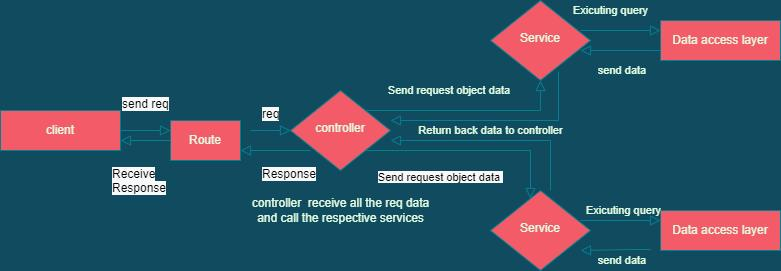

## Summary
* The project is my study about how to write **REST Api** in NodeJs
* **Status**: In progess
----
### Structure
* routes > Get request from browser
* controllers
* models > Database
* services > All business logic is here

----
### Error Handling
> There are two type of errors in Nodejs
### Operational errors
> - Xảy ra trong quá trình ứng dụng hoạt động, nguyên nhân thường là do các đầu vào không bình thường 
> - Không cần khởi động lại ứng dụng

### Programmer errors
> - Nguyên nhân thường đến từ chất lượng của code không tốt
> - cần khởi động lại ứng dụng
